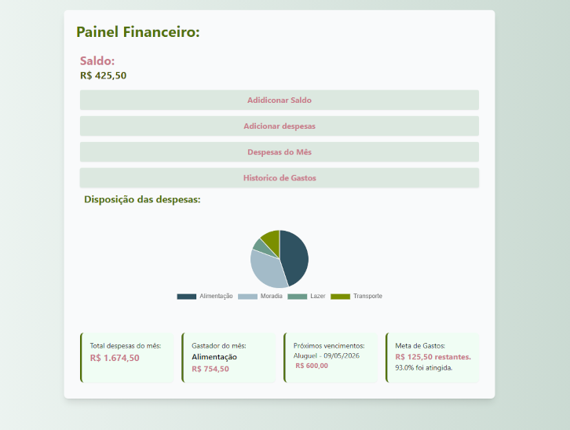

# 👩‍💻 Bruna Beatriz - Front-End Developer

🇧🇷 **Português** | 🇺🇸 **English below**

---

## 🇧🇷 Sobre mim

Olá! Me chamo **Bruna Beatriz** e sou estudante de Engenharia de Software com foco em desenvolvimento Front-End.

Tenho paixão por criar interfaces modernas, responsivas e funcionais, sempre buscando oferecer a melhor experiência para o usuário.

---

## 🚀 Sobre o Projeto

Este repositório contém o meu **portfólio pessoal**, onde apresento alguns dos projetos que desenvolvi utilizando tecnologias web.

O objetivo é demonstrar minhas habilidades práticas em desenvolvimento Front-End.

---

## 🖥️ Acesse o Portfólio

🔗 [Ver projeto online](https://SEU-LINK-AQUI)

---

## 🛠️ Tecnologias utilizadas

* HTML5
* CSS3
* JavaScript
* React
* Git e GitHub

---

## 📂 Projetos em destaque

### 💰 Controle de Gastos

Sistema de gerenciamento financeiro com dashboard, filtros e visualização de despesas.

🔗 [Ver projeto](https://controle-de-gastos-cyan.vercel.app/)
📁 [Repositório](https://github.com/SEU-REPO-AQUI)

---

### ✅ Lista de Tarefas

Aplicação em React com gerenciamento de estado para controle de tarefas.

🔗 [Ver projeto](https://curso-react-fr-y6hn.vercel.app/)
📁 [Repositório](https://github.com/SEU-REPO-AQUI)

---

### 🎮 Jogo da Velha

Jogo interativo desenvolvido com JavaScript puro e interface responsiva.

🔗 [Ver projeto](https://brunabeatriiz.github.io/Javascript/jogo%20da%20velha/index.html)

---

### 📝 To-do List

Lista de tarefas simples utilizando HTML, CSS e JavaScript.

🔗 [Ver projeto](https://brunabeatriiz.github.io/Javascript/to-do)

---

## 📸 Preview

---

## 📬 Contato

* 📧 Email: [brunabeatriz0405@gmail.com](mailto:brunabeatriz0405@gmail.com)
* 💼 LinkedIn: https://www.linkedin.com/in/bruna-beatriz-4b7b8a365
* 💻 GitHub: https://github.com/BrunaBeatriiz

---

## 🇺🇸 About Me

Hi! My name is **Bruna Beatriz** and I’m a Software Engineering student focused on Front-End development.

I’m passionate about building modern, responsive, and user-friendly interfaces, always aiming to deliver the best user experience.

---

## 🚀 About the Project

This repository contains my **personal portfolio**, where I showcase some of the projects I’ve built using web technologies.

The goal is to demonstrate my practical skills in Front-End development.

---

## 🖥️ Live Demo

🔗 [View project online](https://SEU-LINK-AQUI)

---

## 🛠️ Technologies

* HTML5
* CSS3
* JavaScript
* React
* Git & GitHub

---

## 📂 Featured Projects

### 💰 Expense Tracker

Financial management system with dashboard, filters, and expense visualization.

🔗 [Live Demo](https://controle-de-gastos-cyan.vercel.app/)
📁 [Repository](https://github.com/SEU-REPO-AQUI)

---

### ✅ Task Manager

React app with state management for task control.

🔗 [Live Demo](https://curso-react-fr-y6hn.vercel.app/)
📁 [Repository](https://github.com/SEU-REPO-AQUI)

---

### 🎮 Tic-Tac-Toe

Interactive game built with pure JavaScript and responsive interface.

🔗 [Live Demo](https://brunabeatriiz.github.io/Javascript/jogo%20da%20velha/index.html)

---

### 📝 To-do List

Simple task list using HTML, CSS, and JavaScript.

🔗 [Live Demo](https://brunabeatriiz.github.io/Javascript/to-do)

---

## 🎯 Goal

I am looking for my first opportunity as a Front-End Developer, where I can grow my skills and contribute to real-world projects.

---

⭐ If you like this project, consider giving it a star!
